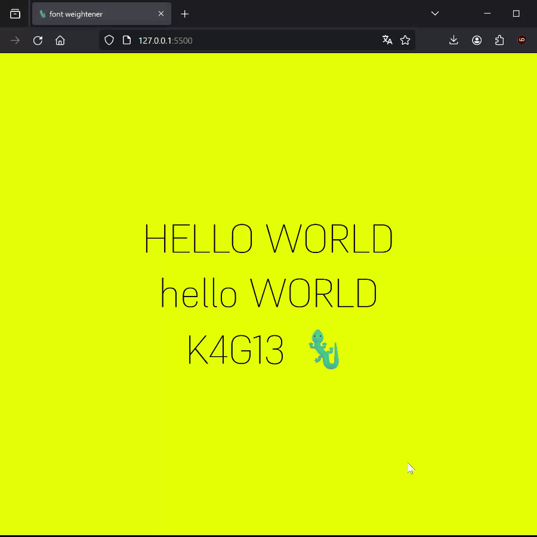

# FONT-WEIGHTENER

A script that changes the font thickness of letters depending on the cursor distance. <br>
Just link js file and add atribute to your html tag:
```html
<div font-weightener="true"> ... </div>
...
<script src="font-weightener.js" defer></script>
```

